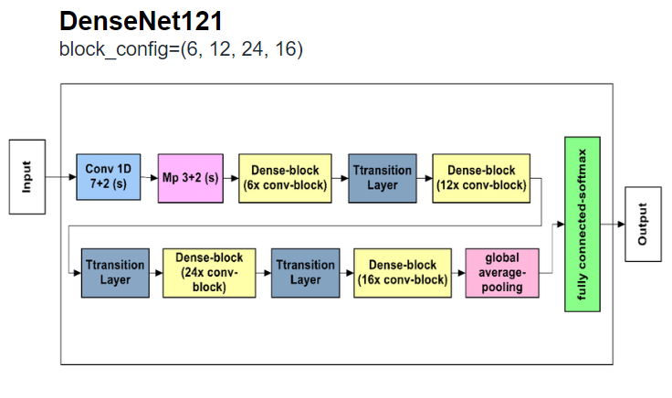
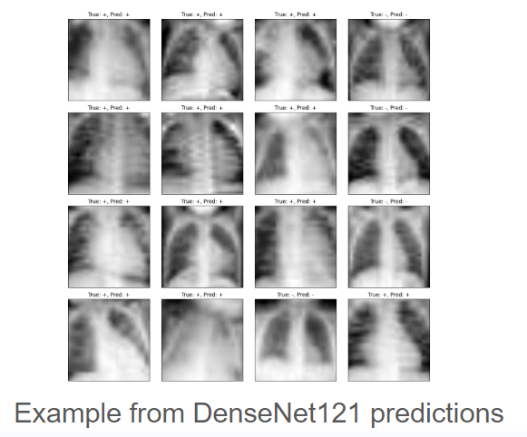
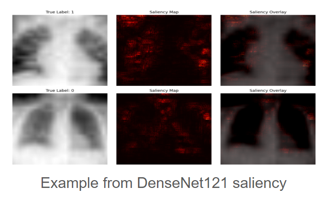
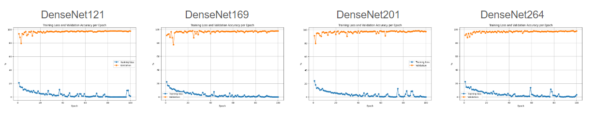
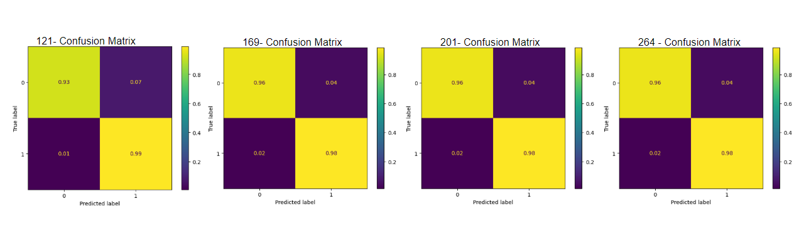

# Machine Learning Final
# Predicting Pneumonia with MONAI and Multiple DenseNets

## Background and Motivation 
Pneumonia is an infection that causes inflammation in one of or both of the air sacs in the lungs. It leads to fluid or pus building up in the lungs making it difficult to breath and get air into the bloodstream. It is one of the leading causes of dealth in the United States, and was responsible for the dealth of 2.5 million people in 2019.

Traditionally, pneumonia is diagnosed by doctors analyzing chest X-rays of patients exhibiting symptoms. However, artificial intelligence (AI) offers the potential to simplify this process and reduce the risk of human error. By leveraging machine learning, AI can be trained to accurately predict whether chest X-rays indicate the presence of pneumonia, providing a reliable and efficient tool for diagnosis.

This AI model uses MONAI and different DenseNets to train on chest X-ray images to classify pneumonia, identifying whether a given X-ray shows signs of pneumonia or not, based on learned patterns from labeled training data. The images used are from MedMNIST's PneumoniaMNIST data set.

## Previous Studies Done
A previous study done by Anthony Novokshanov at Research Archive of Rising scholars examined the PnemoniaMNIST data set and was able to predict pneumonia with an accuracy of 91%. 
This was achieved by a seven layer convolutional neural network (CNN) with rectified linear unit (ReLU) functions that was created with PyTorch libraries and trained on a 15 epoch loop.

Our goal here is to exceed this accuracy through the use of DenseNets and training on a 100 epoch loop

https://www.researchgate.net/publication/352496130_Using_Explainable_Artificial_Intelligence_to_Locate_Pneumonia 

## Goal
The goal is to develop a highly effective model for predicting pneumonia from chest X-rays. Through the use of MONAI's DenseNet models, we aim to surpass the 91% accuracy achieved by Anthony Novokshanov. Additionally, this approach will allow us to compare the performance of different DenseNet variants (121, 169, 201, 264) and identify the most effective model.

## Methods 
### Dataset 
As previously mentioned, the dataset used in this model is MedMNIST's PneumoniaMNIST. 

It is a binary-class data set containing a total 5,856 sample chest x-rays. 

This is split into 4,708 training samples, 524 validation samples, and 624 test samples

### Model 
This code will first load and preprocess the PneumoniaMNIST dataset. It will then build the model using MONAI's DenseNet architecture, trained and validated over 100 epochs. DenseNet121, DenseNet169, DenseNet201, and DenseNet264 will be tested and compared to determine which model achieves the highest efficiency in predicting pneumonia. The DenseNet121 architecture can be seen below with the only noticable difference being the block configuration which leads to varying compuational complexities. 

DenseNet121 uses blocks of 6, 12, 24, 16 and has the lowesst computational complexity. 

DenseNet169 uses blocks of 6, 12, 32, 32

DenseNet201 uses blocks of 6, 12, 48, 32

DenseNet264 uses blocks of 6, 12, 64, 48 and has the highest computational complexity. 

It is predicted that DenseNet264 will perform the best as it is the most complex. 

## Results 
### Example Predictions 
The predictions below were generated by DenseNet121. 

### Saliency Example 
Saliency is the importance of individual pixels, feature or regions that are used in making a models prediction. The images below show how the model (DenseNet121 in this example) uses certain pixels to make predictions. 

### Training Loss and Validation Accuracy 
The graphs below show the training loss and accuracy throughout each of the 100 epochs. All DenseNet models performed extremely well and show very similar graphs. 

### Confusion Matrices 
The confusion matrices below show exactly how each DenseNet model performed. It is noted that while DenseNet264 did perform the best, DenseNet201 and DenseNet169 has the exact same results

## Conclusions 
After comparing all the DenseNet models, it is clear that they all performed exceptionally well and very similarly. As expected, DenseNet264, being the most computationally complex, delivered the best performance. However, the confusion matrices for DenseNet201 and DenseNet169 show identical values, indicating that they performed equally as well. In conclusion, using a less computationally complex DenseNet typically yields similar results and efficiency. 

